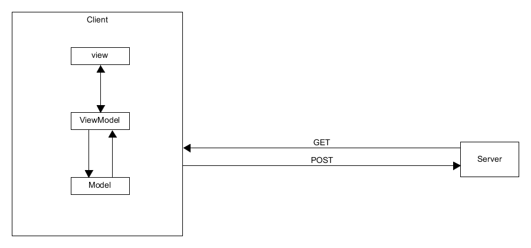

# 软件设计文档
## 前端web页面部分
### 1. 概述
该点餐系统是使用vue框架开发的移动web页面，利用vuex组件进行状态管理，axios组件进行前后端交互，使用mint-ui组件库实现UI。整个web应用主要包括MainPagee、StoreInfoPage、OrderPage和PayPage四个主要的页面组成，每个页面又由多个vue组件组成。
### 2. 技术选型理由
本次开发主要是在vue框架进行的前端开发，选择该框架主要有以下几个理由：
- vue上手容易。本次负责开发前端的组员之前并没有接触过前端开发，而vue让初学者也能快速上手
- vue是一个基于MVVM模式的数据驱动页面框架，具有声明式渲染和条件与循环两大特征，让我们能以非常简单的方法将数据与页面中的组件绑定在一起，减少了开发任务
- vue还有一个很重要的特征就是组件化应用构建，使我们能够将一个大的页面分解成多个不同的组件来进行开发。且这种组件化的构建方法更加有利于团队开发，提高了开发效率
- 本次实现的点餐系统主要是面向移动端的，vue更加适合用于开发移动端web应用
- vue能够很方便的引入第三方组件，利用这些组件我们可以很轻松的实现各种功能（比如用vuex实现不同页面不同组件之间的数据传递）
### 3. 架构设计
该点餐系统从总体上看是一个客户端-服务器模式的系统，客户端从服务器获取商家信息、菜品信息等数据并显示，然后向服务器提交订单数据。如果仅仅针对客户端来说，使用的是一个三层架构的设计模式。如图所示

- 四个主要的页面处于显示层，主要负责显示数据
- 在页面组件中已经指定了数据应该如何绑定到页面控件上面，但具体的绑定操作是由框架实现的并不需要我们去手动实现。
- 在数据访问层中，所有的数据其实都是储存在store/index.js文件中，再通过vuex组件对这些数据进行访问
### 4. 模块划分
该点餐系统主要分为四个主页面，然后每个页面主要是由多个不同的组件构成的

### 5. 软件设计技术
该系统主要涉及mvvc涉及模式，因为vue是一个基于mvvc的前端框架。但是该设计模式并不需要我们自己去实现。
